# AplifyAI

<div align="center">

**An intelligent job application assistant that automates resume generation, cover letter creation, and application form filling using AI.**

[](https://nextjs.org/)
[](https://www.typescriptlang.org/)
[](https://firebase.google.com/)
[](https://ai.google.dev/)

</div>

---

## 📊 Visual Overview

### User Journey

```mermaid
graph LR
    A[🔐 Sign Up] --> B[📄 Onboarding]
    B --> C[📊 Dashboard]
    C --> D[🔍 Browse Jobs]
    D --> E[🤖 Generate Documents]
    E --> F[⚡ Auto-Fill Application]
    F --> G[📈 Track Progress]
    
    style A fill:#3DCEA5,stroke:#2aa889,color:#000
    style E fill:#3DCEA5,stroke:#2aa889,color:#000
    style F fill:#3DCEA5,stroke:#2aa889,color:#000
```



### Application Flow Process

Our intelligent 5-step automation process ensures seamless job applications:

```mermaid
graph TD
    A["Step 1: Collect Data<br/>(0-10%)<br/>📋 Extract job details from page"] --> B["Step 2: Fill Generic Questions<br/>(10-30%)<br/>⚡ Instant fill using cached profile"]
    B --> C["Step 3: Generate Documents<br/>(30-70%)<br/>🤖 AI creates resume & cover letter PDFs"]
    C --> D["Step 4: Fill AI Questions<br/>(70-90%)<br/>🧠 Smart answers using generated content"]
    D --> E["Step 5: Verify & Submit<br/>(90-100%)<br/>✅ Validate and scroll to submit"]
    
    style A fill:#3DCEA5,stroke:#2aa889,color:#000
    style B fill:#4dd4b5,stroke:#2aa889,color:#000
    style C fill:#6ddac5,stroke:#2aa889,color:#000
    style D fill:#8de0d5,stroke:#2aa889,color:#000
    style E fill:#ade6e5,stroke:#2aa889,color:#000
```



### Architecture


---

## 🚀 Features

- **🤖 AI-Powered Resume Generation**: Tailor your resume to specific job descriptions using Gemini AI
- **✍️ Smart Cover Letters**: Generate personalized cover letters with adjustable tone and length
- **⚡ Auto-Fill Applications**: Browser extension auto-fills job applications with your tailored documents
- **📈 Job Tracking**: Keep track of all your applications, statuses, and documents in one place
- **📊 Analytics Dashboard**: Visualize your job search progress with charts and insights
- **📄 Resume Parsing**: Upload your existing resume to auto-fill your profile
- **🌐 Cross-Platform**: Available as web app, browser extension, mobile (iOS/Android), and desktop (Mac/Windows)

---

## 🛠️ Tech Stack

### Frontend
- **Next.js 14** - React framework with App Router
- **TypeScript** - Type-safe development
- **Tailwind CSS** - Utility-first styling
- **Capacitor** - Mobile app wrapper (iOS & Android)
- **Electron** - Desktop app wrapper (Mac & Windows)

### Backend Services
- **Next.js API Routes** - Serverless API endpoints
- **Node.js Microservices** - Resume generator service
- **LaTeX** - Professional PDF generation

### Data & Storage
- **Firebase Firestore** - NoSQL database
- **Google Cloud Storage** - File storage
- **Firebase Authentication** - User management

### AI & Intelligence
- **Google Gemini 1.5 Flash** - AI-powered content generation
- **JWT** - Secure authentication tokens

---

## 🏁 Getting Started

### Prerequisites

- Node.js 18+
- npm or yarn
- Google Cloud Platform account with Firestore and Storage enabled
- Gemini API Key

### Installation

1.  **Clone the repository**
    ```bash
    git clone <repository-url>
    cd aplifyai-web
    ```

2.  **Install dependencies**
    ```bash
    npm install
    ```

3.  **Environment Setup**
    
    Create a `.env.local` file in the root directory:
    
    ```env
    # Firebase Admin
    FIREBASE_PROJECT_ID=your-project-id
    FIREBASE_CLIENT_EMAIL=your-client-email
    FIREBASE_PRIVATE_KEY="your-private-key"

    # Firebase Client
    NEXT_PUBLIC_FIREBASE_API_KEY=your-api-key
    NEXT_PUBLIC_FIREBASE_AUTH_DOMAIN=your-project.firebaseapp.com
    NEXT_PUBLIC_FIREBASE_PROJECT_ID=your-project-id
    NEXT_PUBLIC_FIREBASE_STORAGE_BUCKET=your-project.appspot.com
    NEXT_PUBLIC_FIREBASE_MESSAGING_SENDER_ID=your-sender-id
    NEXT_PUBLIC_FIREBASE_APP_ID=your-app-id

    # Services
    RESUME_GENERATOR_URL=http://localhost:8000
    RESUME_GENERATOR_API_KEY=123456
    
    # JWT
    JWT_SECRET=your-secret-key
    ```

4.  **Start the Resume Generator Service**
    
    Navigate to the `resume-generator` directory:
    ```bash
    cd ../resume-generator
    npm install
    PORT=8000 npm start
    ```

5.  **Start the Web Application**
    ```bash
    cd ../aplifyai-web
    npm run dev
    ```

6.  **Open the App**
    
    Visit [http://localhost:3000](http://localhost:3000)

---

## 📱 Usage Flow

### Web Application

1.  **Sign Up** - Create your account
2.  **Onboarding** - Upload your resume or manually enter your details
3.  **Dashboard** - View your stats and recent activity
4.  **Jobs** - Create and manage job applications
5.  **Generate** - Create tailored resumes and cover letters
6.  **Track** - Monitor your application progress

### Browser Extension

1.  **Install Extension** - Load the extension from `apps/extension`
2.  **Login** - Authenticate with your AplifyAI account
3.  **Navigate to Job** - Open any job application page
4.  **Auto-Fill** - Click the extension to automatically fill the application
5.  **Review & Submit** - Verify the filled information and submit

---

## 🌐 Platform Availability

### 📱 Mobile App (iOS & Android)

Built with **Capacitor** for native mobile experience.

**Setup:**
```bash
# Sync project files
npx cap sync

# Run on iOS (Mac only)
npx cap open ios

# Run on Android
npx cap open android
```

### 🖥️ Desktop App (Mac & Windows)

Built with **Electron** for native desktop experience.

**Development:**
```bash
npm run electron:dev
```

**Build:**
```bash
npm run electron:build
```

### 🔌 Browser Extension (Chrome/Edge)

**Load Unpacked Extension:**
1. Navigate to `chrome://extensions/`
2. Enable "Developer mode"
3. Click "Load unpacked"
4. Select the `apps/extension` directory

---

## 📁 Project Structure

```
aplifyai-web/
├── apps/
│   └── extension/          # Browser extension
├── docs/
│   └── images/             # Documentation images
├── public/                 # Static assets
├── src/
│   ├── app/               # Next.js app router pages
│   ├── components/        # React components
│   ├── lib/               # Utilities and services
│   └── styles/            # Global styles
└── electron/              # Electron desktop wrapper
```

---

## 🤝 Contributing

Contributions are welcome! Please feel free to submit a Pull Request.

---

## 📄 License

MIT License - feel free to use this project for personal or commercial purposes.

---

## 🔗 Related Services

- **Resume Generator Service** - LaTeX-based PDF generation microservice
- **LaTeX PDF Service** - Document compilation service

---

<div align="center">

**Built with ❤️ using Next.js, Firebase, and Google Gemini AI**

</div>
